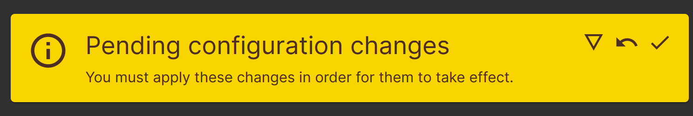

# Creating a NAS with a raspberry pi 4B

## Hardware

- Raspberry Pi 4B 4GB
- Spare storage drive

## Software

- Raspbian Buster Lite
- [OpenMediaVault](https://www.openmediavault.org/) (OMV)
- Samba

## Headless + Wireless Setup

Using the [Raspberry Pi Imager](https://www.raspberrypi.com/software/), flash the following OS flavor onto the sd card:  
  
**Raspberry Pi OS Lite (64-bit)**  
  
On the next screen, add the following configurations:  

- Add a hostname
- Add username and password
- Add the Wi-Fi SSID and Password
- Under the *Services* tab enable SSH to be able to access the Pi.  

### First boot

Slot in the SD Card on the Raspberry Pi and supply power via the Type-C Port. After about a minute, try to log into the Raspberry Pi via SSH.

> ssh [user]@[hostname]  

At this point, I recommend installing [pip3](https://pip.pypa.io/en/stable/) before installing the **OpenMediaVault** (OMV) project onto the pi.

```sh
sudo apt update -y && sudo apt install python3-pip -y  
```

After installation is complete, it is time to install OMV!  

## Open Media Vault Install

OMV will be installed using the [InstallScript](https://github.com/OpenMediaVault-Plugin-Developers/installScript).  
However, in order to preserve the SSH access to the Pi, it is important to [skip](https://github.com/OpenMediaVault-Plugin-Developers/installScript#to-skip-network-setup) the network setup.  

> [!CAUTION]  
> Not using the `-n` flag could result in the raspberry pi being unreachable, in which case repeat the [steps above](#headless--wireless-setup)  
  
```sh
wget https://raw.githubusercontent.com/OpenMediaVault-Plugin-Developers/installScript/master/install 
chmod +x install
sudo ./install -n 
# It is really important to not forget -n!!!
```
  
> [!TIP]  
> In the case that `raw.githubusercontent.com` cannot be resolved, I recommend downloading the file on Host machine and moving to Raspberry Pi via scp:  
>  
> `scp install [user]@[hostname]:/tmp/install`

Once  installation is complete, OMV will start a webservice on the Pi. To access it, open a browser tab and navigate to:  
  
`http://[hostname]/`  
  
  

> [!NOTE]  
> Default Credentials:  
> username: admin  
> password: openmediavault  
> **Please change the admin password after first login**  

Open Media Vault has a wide variety of features and extensibility. However, we will be focusing on setting up an SMB share and a VPN connection for the same (along with a few minor configurations). In order to learn more about OMV's functionality read the [feature list](https://www.openmediavault.org/features.html).  

## Drive Configuration

> This point onwards, the configurations will need to be *committed*.  
> This can be done by clicking the checkmark when the banner is visible:  
> 

In order to mount and share a drive, configurations need to be created in a few different places.  

> [!TIP]
> In the case that the drive has data and wiping is not an option, skip to [Mounting](#mounting-a-drive).
  
### Wipe a drive

Navigate to Storage > Disks, click on the device and select wipe.  

  

### Create a File System on the drive  

Wiping the device allows us to start with a fresh drive. A filesystem is needed to be created on the device in order to use the drive for file storage.

Navigate to Storage > File Systems > Create and mount a file system (the + icon)  

> [!TIP]  
> *I suggest using EXT4 for the purpose of creating the SMB share.*  

  
  
On the "Create" page you can select the device and click "Save" in order to create the File System on the new drive.  

#### Mount a drive  

*This step should be skipped if a filesystem was created on a wiped drive. OMV will auto-mount the drive after creating the File System.*  
  
At Storage > File Systems, select "Mount" (blue play button) and add the device with pre-created file system.  

Additional configuration options can be selected here.  

  

### Create a Shared Folder  

Creating a shared folder is necessary for the services to be used and additionally allows the extended functionality for permissions and Access Control Lists (ACLs) / taking storage snapshots, etc.  

At Storage > Shared Folders > Create:  

- Create a name (to be used as id) for the folder.  
- Select the Device which was mounted.  
- Set Permissions for the shared folder.  
  
Example config:  

  

## SMB Service Configuration

### Enable SMB

Navigate to Services > SMB/CIFS > Settings  

- Enable SMB
- Set Workgroup name
- Advanced Settings (optional)
  - Set minimum protocol version to SMB3
    - Ensure that all devices can support SMB3, if unsure do **not** configure it!
  - Enable Asynchronous I/O.
  - Enable Use Sendfile.
- Save

  

### Create a Share

Navigate to Services > SMB/CIFS > Shares > Create  

Below are configurations for my smb share:  

- Enable share
- Select the [created shared folder](#create-a-shared-folder)
- Set Browseable
- Set Time Machine support
- Set Transport encryption
- Set Inherit ACLs
- Enable recycle bin
  - Maximum file size: 25 MiB
  - Retention Time: 0 (manual deletion)  
- Unset 'Hide dot files'
- Set Extended attributes
- Store DOS attributes
- Set Audit File operations

  

## Secure SMB

### IP Restriction

In order to **better secure** the samba share, restrict the hosts that can access the share to specific hosts or the local network.  
 
In this case, the whitelist is:  
`192.168.0.0/24`

This can be set in the [share configuration](#create-a-share)  

Additionally, individual IPs can be whitelisted/blacklisted written as a comma separated list.  

### User Restriction

It is important to create users in order to access the SMB share with a username/password combination as the configuration intially prevents guest login.  

Create users at Users > Users > Create

- Adding sambashare group is optional.  


Save and commit changes. Then select the user and click "Shared Folder Permissions"

  

The individual folder permissions can be set for each user via this process.  
  


## Access the share

Access via Windows:  

- File Explorer lists the workgroup name in the network tab.
  - <br>
- The individual files are accessed wiithin the workgroup, wherein the directory can be accessed using the credentials [created](#user-restriction) during the setup.  
  - <br>

Access via iOS: [link](https://support.apple.com/en-in/guide/iphone/iph8d8f0f1a0/ios)  

Access via Android: [link](https://www.wikihow.com/Access-a-Shared-Folder-on-Android)  

Access via Linux: [link](https://tldp.org/HOWTO/SMB-HOWTO-8.html)  

## Conclusion

Through this setup, a NAS srever was created using OMV on a raspberry pi. It is a great way to utilize old Hard Disk Drives or other storage media that is not actively being used.  

Setting up a SMB share in such a way allows devices on the private network to use the drives to store files without necessarily having a direct wired connection to the drive.  
